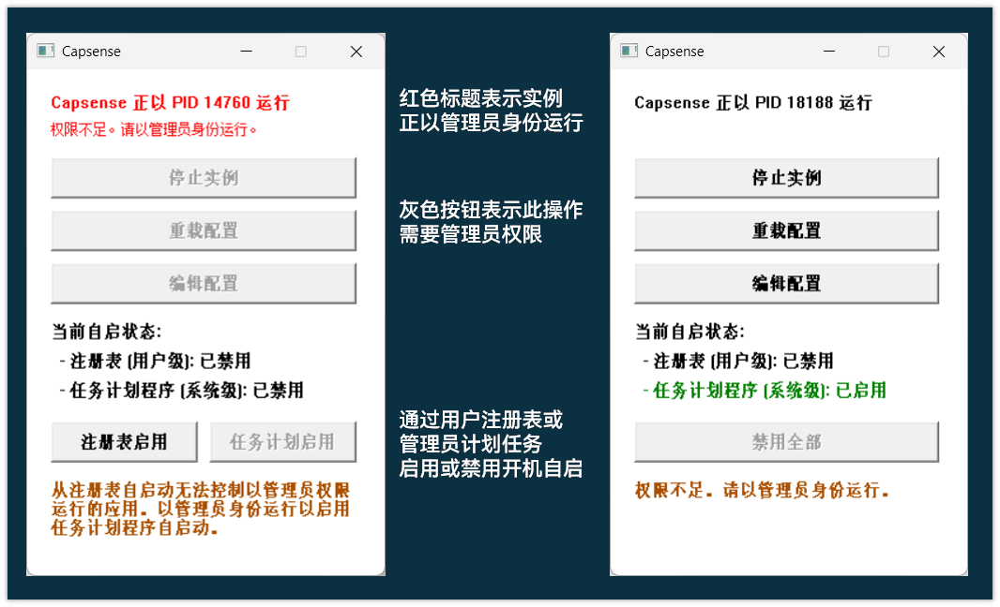

[`English`](README.md) | **中文**

# Capsense

在 Windows 上，将 `CapsLock` 键用于切换输入法。

Capsense 的名字来自于 "CapsLock" + "Sense"，即让 CapsLock 键 Make Sense（变得有意义），通过赋予它新的功能来提升输入体验。

## 为什么？

在 Windows 上，用于切换输入语言的默认快捷键（例如 `Shift` 和 `Win + Space`）
可能会让人对当前输入法状态感到困惑。

macOS 通过将常被闲置的 `CapsLock` 键用作输入源切换键以解决这个问题。**Capsense** 将此行为带到 Windows，
通过轻按 `CapsLock` 键触发 IME 切换，同时通过长按保留 `CapsLock` 的原始用途。

## 功能

- 短按 `CapsLock` 来切换输入法。
- 长按以切换大写锁定。
- 在后台高效运行，占用资源极少。
- 可轻松更改轻按判定阈值和所触发的操作。

## 使用方法

直接运行可执行文件，即可开始监控 `CapsLock` 事件。

默认情况下，从文件资源管理器启动时，Capsense 将使用弹窗显示必要的提示信息，
通过其他方式（例如命令行）启动时则不会弹窗。你可以通过命令行参数来修改这一行为。

建议在输入法设置中禁用 `Shift` 键切换 IME 状态的功能，以获得最佳体验，因为这可能会让你困惑。
使用 `CapsLock` 切换键盘布局，使用 `Win+Space` 切换当前键盘布局的主输入法。

## 实例管理器

当已有实例正在运行时，从资源管理器启动 Capsense，或使用 `--gui` 参数运行 Capsense，
会打开 **实例管理器**。你可以在其中无需命令行即可控制正在运行的实例。



## 管理员权限

Capsense 本身不依赖管理员权限。

但是，如果你想让 Capsense 控制以管理员身份运行的应用程序，则需要以管理员身份运行 Capsense。

未提权的 Capsense 实例无法控制提权的实例。

## 配置

首次运行时，Capsense 会在同一目录下创建 `config.toml` 文件。你可以自定义以下内容：

- `tap_threshold_ms`：超过这个时间的按压将被视为长按。默认为 `300` ms。
- `tap_action`：在轻按时执行的动作。支持的动作为：
    - `shortcut`：触发一个键盘快捷键（由 `tap_shortcut` 定义）。
    - `switch_layout`：（默认）轮换输入布局。
- `tap_shortcut`：要触发的快捷键（默认为 `["LWIN", "SPACE"]`）。支持的按键有：
    - `LWIN`（或 `WIN`)
    - `SPACE`
    - `LCONTROL`（或 `CTRL`)
    - `LSHIFT`（或 `SHIFT`)
    - `LMENU`（或 `ALT`)
    - `CAPSLOCK`
- `layouts`：当 `tap_action` 设置为 `switch_layout` 时要轮换的一组输入布局 ID。
    - 默认：`[0x0804, 0x0409]`（`zh-CN` 和 `en-GB`）。
    - 有关更多布局 ID，请参见[微软文档](https://learn.microsoft.com/en-us/openspecs/windows_protocols/ms-lcid/70feba9f-294e-491e-b6eb-56532684c37f)。其他常见的有：
        - `0x0404`：繁体中文
        - `0x0411`：日文
        - `0x0412`：韩文
- `no_en`：若启用，Capsense 将防止中文输入法在布局切换或焦点更改后进入英文模式。（默认为 `true`）。
    - 灵感来自 [`mbbill/no_english_mode`](https://github.com/mbbill/no_english_mode)。

### 命令行参数

程序支持以下命令行参数：

- `-h, --help`：显示此帮助信息并退出。
- `-d, --daemon`：在后台启动 Capsense。
- `-s, --stop`：停止正在运行的 Capsense 实例。
- `-r, --reload`：让正在运行的实例从 `config.toml` 重新加载配置。
- `-S, --status`：检查是否有 Capsense 实例在运行并显示其 PID。
- `--gui`：允许 Capsense 显示 GUI 窗口。
- `--headless`：阻止 Capsense 显示任何 GUI 窗口。
- `--startup <enable|disable> [--user]`：启用或禁用开机自启。
  - `--user`：使用用户级自启（注册表）而不是系统级（任务计划程序）。
  - 调用 `--startup disable` 时，Capsense 将始终尝试禁用这两种自启方式。

## 变体

- `Capsense` 是默认构建版本，包含所有功能。
- `Capsense-headless` 不包含 GUI 组件，始终以无头模式运行。如果您想要极低的资源占用，这是理想的选择。

## 开发

```shell
git clone https://github.com/alex3236/Capsense
cd Capsense
cargo build
cargo build --no-default-features --bin Capsense-headless
```

## 许可

```
Capsense 是自由软件；
您可以根据自由软件基金会发布的 GNU 通用公共许可证第 3 版，
或（由您自行选择）任何更高版本的条款对其进行再发布和/或修改。

我们发布 Capsense 的目的是希望它能够发挥作用，但不提供任何担保；
甚至不包含适销性或适用于特定用途的默示担保。有关详细信息，请参阅
GNU 通用公共许可证。

您应该已经随本程序一起收到了 GNU 通用公共许可证的副本。
如果没有，请参见 <https://www.gnu.org/licenses/>。
```